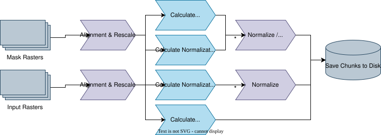
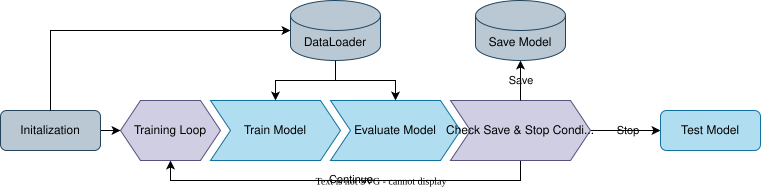
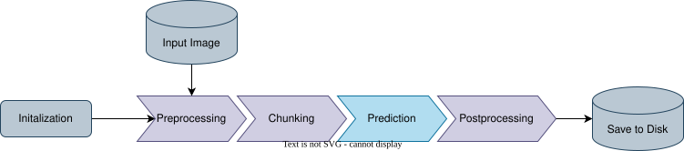

About the Project
=================

Introduction
------------
Classification and Segmentation are integral to geospatial analysis, 
being used heavily across the field from land cover classification to crop yield prediction. 
Although these types of analysis can be done in many ways, neural networks are increasingly being used 
due to their ability to recognize complex patterns and relationships in spatial data. 
Unfortunately, designing a neural network and encoding input data for it is a complex task. Requiring programming experience, 
knowledge of neural networks, and knowledge of how to encode the type of data being input into the neural network.

QLearn simplifies this task by allowing users to train a neural network model for segmentation and classification 
of any type of raster geospatial data using a GUI interface from within QGIS.
Since this plugin will be directly integrated with QGIS it means that GIS analysis involving neural network training 
can be done without the need for code or external tools. 
Advantages of this approach include simplifying and speeding up analysis workflows, 
and improving the accessibility of neural network training.

Features
--------
* Automatic Alignment and Rescaling
    - QLearn automatically aligns input and target rasters to ensure traning is accurate
    - QLearn can also rescale the input and target rasters to reduce the detail of the data as specified by the user
* Automatic Normalization
    - QLearn can automatically normalize input and target rasters to improve training stability
    - If target normalization is selected, QLearn will automatically denormalize the output rasters after prediction
* Testing and Validation
    - QLearn automatically splits the input data into training, and validation datasets which are used to evaluate the model during training.
    - QLearn can also use a separate testing dataset to evaluate the model after training.
* Confidence Levels
    - QLearn can filter out predictions that are below a specified confidence level.
    - This is useful for ensuring that the model only makes predictions when it is confident in its output.
* Multiband Support
    - QLearn can train models on any number of input bands, and any number of output classes.
    - This allows for a wide range of applications, from simple binary classification to complex multi-class segmentation tasks.

Methods
-------

Preprocessing
^^^^^^^^^^^^^
The first step in the QLearn workflow is to preprocess the input data. 
The QGIS preprocessing workflow aims to simplify the process of preparing data for training by allowing the user to perform a number of common preprocessing steps.
Steps denoted with a * are optional and based on the settings chosen by the user.

1. **Alignment & Rescaling:** 
    When working with raster-based training data, it is important to ensure that the input data is aligned with the target data.
    With geospatial data, this means that the rasters must have the same coordinate reference system (CRS), pixel size, and extent.
    QLearn will automatically align the input data to the target data, and rescale the target data to match the input data.
    Additionally, as QgsAlignRasters provides the ability to rescale the data, any user specified rescaling will be done in this step.
    This step simplifies the time consuming process of alignment and rescaling, making it easier to prepare the data for training.

2. **Calculating Chunks:** 
    The next step is to calculate the chunks of data that will be used for training. 
    This is done by dividing the input data into smaller chunks of a specified size. 
    This is important for training neural networks, as it allows the model to learn from smaller portions of the data at a time, 
    which can help with convergence and stability during training. 
    Additionally, raster data is often too large to fit into memory all at once, so chunking the data allows for more efficient processing.
    Optionally, the user can manually specify a chunk size to use for training.

Target (mask) Raster Processing
...............................

1. **(Classification Only) Calculate Class Mappings:** 
    Sometimes when working with classification data, the classes may not be continuous from 0 to N, 
    which is a requirement for the loss function used by QLearn (CrossEntropyLoss).
    In this case, the classes will automatically be reclassified to be continuous from 0 to N + 1, 
    where N is the number of classes in the input data +1 for the NODATA class.

Input & Target Raster Processing
.................................

1. **Calculate Normalization Parameters:** 
    The next step is to calculate the normalization parameters per-band for the input data. 
    This step is important for training neural networks, as it helps to stabilize the training process and improve convergence.
    The user can also specify whether or not to normalize the input data.
    Normalization is done using `Welford's Online Algorithm <https://en.wikipedia.org/wiki/Algorithms_for_calculating_variance>`_ 
    as the possibility of retraining and the large size of the data makes it impractical to calculate the mean and standard deviation in a single pass.

2. **(Optional) Normalization & Reclassification:** 
    Based on the user settings, the input and target data will be normalized based on the previous calculations.
    Additionally, the target data will be reclassified based on the calculated class mappings
    Normalization is done using sigmoid normalization as the possibility of data outside the previously calculated min/max values during retraining 
    makes it impractical to use min-max normalization. This means that newly encountered data will not be lost during retraining.
    The user can also specify whether or not to normalize the input and target data.

3. **Saving:** 
    The final step in the preprocessing workflow is to split the processed rasters into chunks and save them to disk.
    This is important as GIS datasets are often too large to fit into memory all at once, 
    and preprocessing and saving the data avoids having to normalize and reclassify the data again during training.

The Model
^^^^^^^^^

QLearn uses a UNet architecture for training and prediction.
The UNet architecture is a convolutional neural network (CNN) that is widely used for image segmentation tasks.
Additionally, it is already widely used for various types of classification and segmentation in the GIS field[9], 
making it a good choice for this plugin.

Unlike a traditional neural network, QLearn's UNet architecture is modular, allowing it to be used with any number of channlels or input image size.
Additionally, the depth, and number of channels in the network can be customized by the user to suit their needs.
This results in a flexible model that can be compacted for quick training and inference, or expanded for more complex tasks.

The implementation used for QLearn's UNet model was a modified version of the implementation found in the blog post 
`U-Net A PyTorch Implementation in 60 lines of Code <https://amaarora.github.io/posts/2020-09-13-unet.html>`_, written by Aman Arora.
I suggest checking out the post for a more in-depth explanation of the UNet architecture and how it works.

Training
^^^^^^^^

1. **Initialization:**
    The first step in the training process is to initialize the model. 
    This includes creating the model, setting the optimizer, loss function, and learning rate scheduler. As well as creating the training and validation datasets.
    The parameters for the model are set based on the user settings, and depend on the type of task being performed (classification or regression).

Training Loop
.............

2. **Training and Evaluation:**
    The next step is to train the model. 
    This is done by iterating over the training dataset and updating the model weights based on the loss function.
    The training loop will run for a specified number of epochs, and will evaluate the model on the validation dataset after each epoch.

3. **Checking Conditions:**
    During the training loop, the model will check for the following conditions:
    - If the validation loss has not improved for a specified number of epochs (patience), the training will stop.
    - If the validation loss has improved, the model will save the current best model weights (depending on save mode).
    - If the number of epochs has been reached, the training will stop.

Other Steps
...........

4. **Saving the Model:**
    After the training loop has completed, the model will save the final model weights to disk. 
    In addition to the model weights, the model saves many additional parameters to disk to assist with retraining and prediction.
    This includes the normalization parameters, class mappings, optimizer/scheduler states, and model architecture.
    Although this does make it more difficult to load the model in other frameworks,
    it allows for a more seamless experience when retraining and making predictions.

5. **Testing the Model:**
    After the training loop has completed, the model will be tested agains the testing dataset, 
    and the accuracy and loss statistics will be displayed.
    This is important for understanding how well the model performs on unseen data,
    and can help to identify any issues with the model or the training process.

Prediction
^^^^^^^^^^

1. **Initialization:**
    The first step in the prediction process is to initialize the predictor. 
    This includes loading the model weights, normalization parameters, and class mappings from disk.
    The parameters for the model are set based on the user settings, and depend on the type of task being performed (classification or regression).

2. **Preprocessing:**
    In order for predictions to be accurate, the input data must be preprocessed in the same way as the training data.
    This includes normalizing the input image based on the saved normalization parameters, and splitting the input image into chunks.

3. **Making Predictions:**
    The next step is to make predictions using the model. 
    This is done by iterating over the input dataset and passing each chunk through the model.
    The model will output a probability map for each class, which can be thresholded to create a binary mask for each class (in the case of classification).

4. **Postprocessing:**
    After the predictions have been made, the model will postprocess the output data. 
    This includes denormalizing the output data based on the saved normalization parameters (if regression), 
    or reclassifying the output data based on the saved class mappings (if classification).
    The output data will be saved as a GeoTIFF file, which can be easily opened in QGIS or other GIS software.