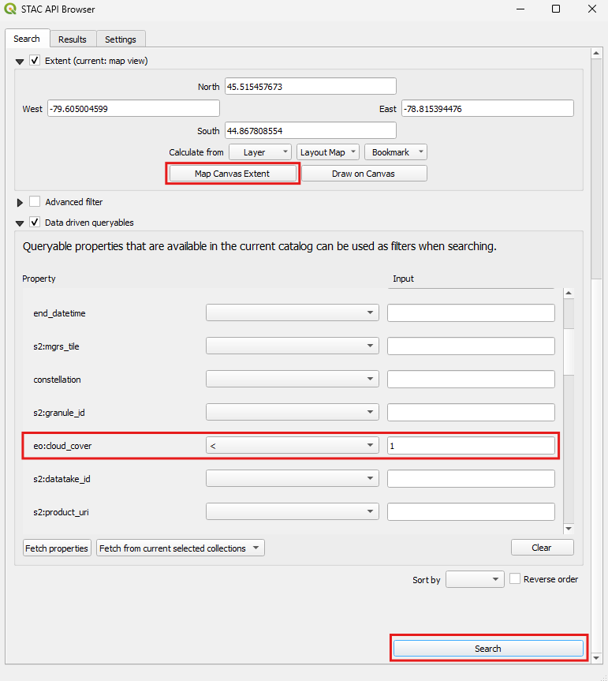
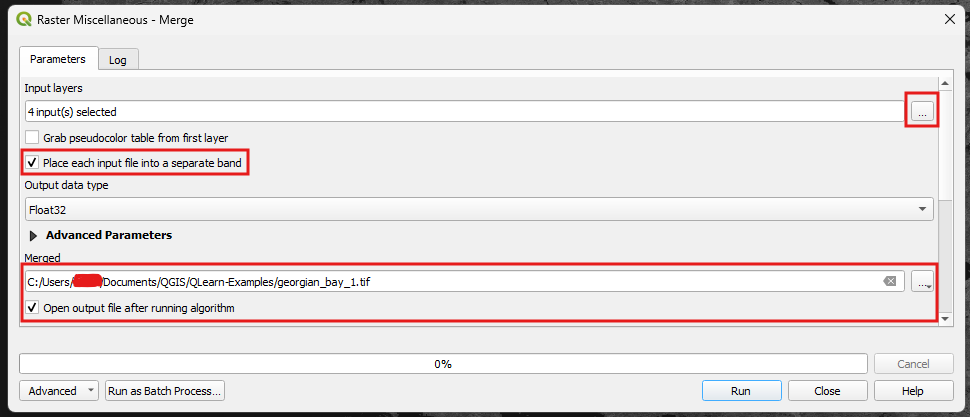
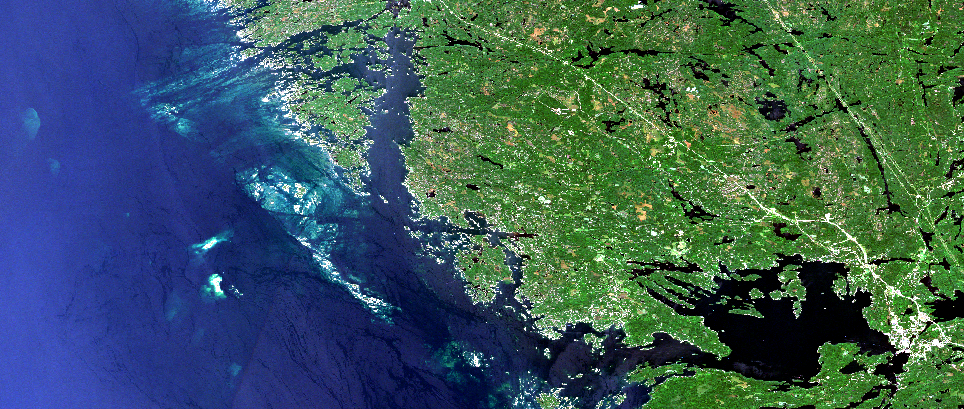
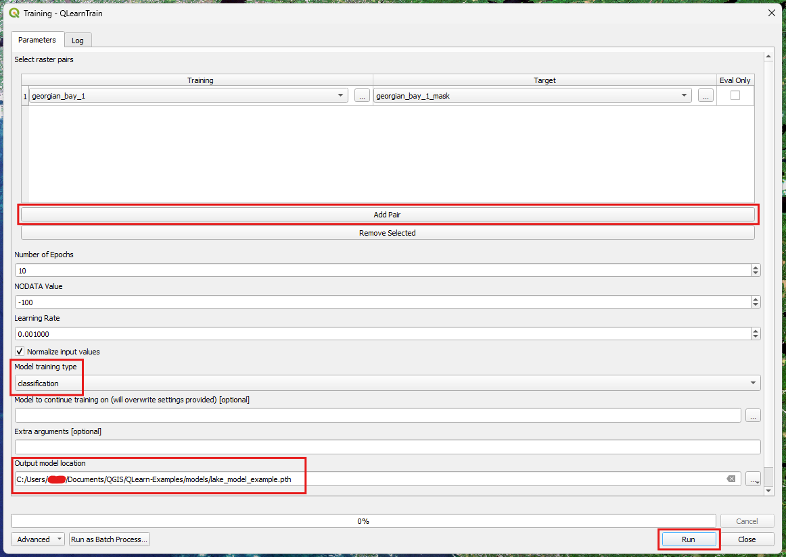
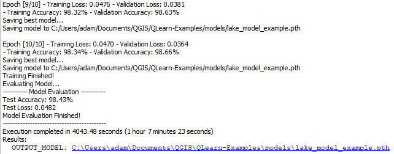
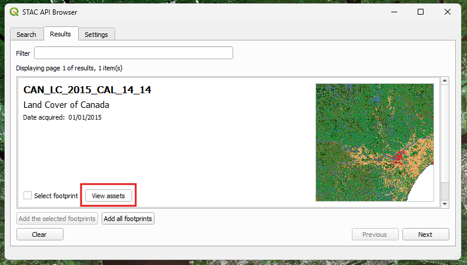
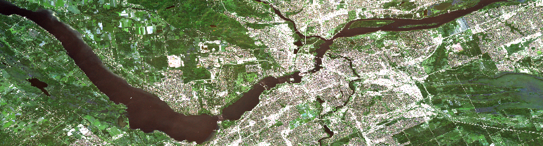
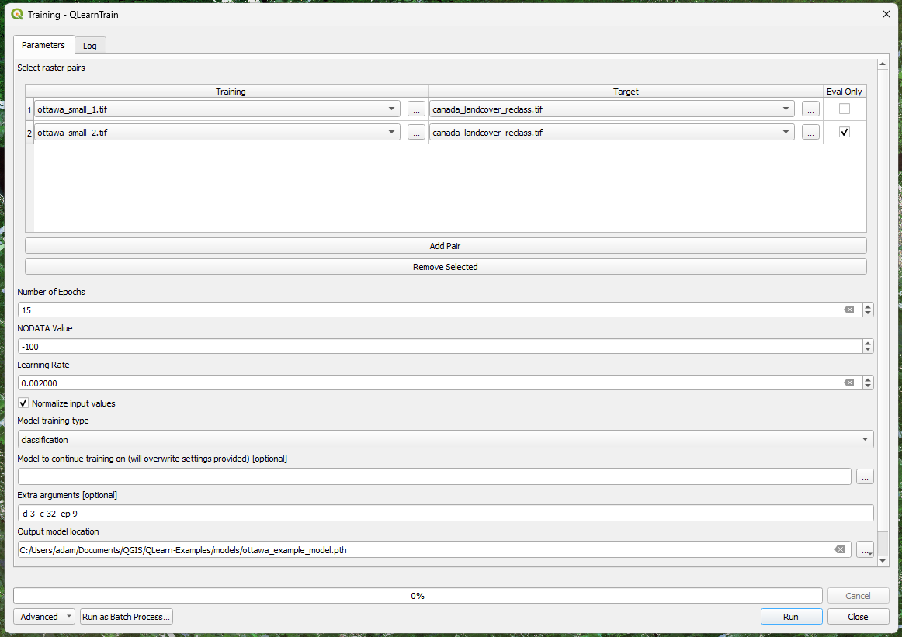

Examples
========

Example 1: Water Classification
--------------------------------

**Description:**

This example demonstrates how to use QLearn to detect and classify water bodies in a raster image.

- Learn how to convert vector data to a raster mask
- Learn how to obtain sattelite imagery from directly within QGIS
- Learn how to train a model using the QLearn plugin
- Learn how to make predictions using the trained model

**Data Sources:**

- Sentinel-2 or Landsat 8 satellite imagery (from STAC API Browser)
- `Ontario Hydro Network (OHN) Dataset <https://geohub.lio.gov.on.ca/datasets/mnrf::ontario-hydro-network-ohn-waterbody/about>`_

**Time Required:**

- 10-20 minutes to gather data
- 30-120 minutes to train the model (depending on the size of the dataset and your computer's performance)
- 1-10 minutes to make predictions (depending on the size of the image and your computer's performance)

Gathering The Data (Using STAC API Browser)
^^^^^^^^^^^^^^^^^^^^^^^^^^^^^^^^^^^^^^^^^^^

1. Open QGIS and create a new project.
2. Download your preferred Waterbody Vector Dataset (e.g. Ontario Hydro Network) and add it to your QGIS project.
3. Open the plugins menu and select Manage and Install Plugins.
4. Search for "STAC API Browser" and "QLearn" and install them.

   - Note: QLearn requires the installation of additional dependencies. `Follow the steps here to install <https://qlearn.readthedocs.io/en/latest/tutorial.html>`_.
5. Open the STAC API Browser plugin and search for "Sentinel-2" or "Landsat 8" to find satellite imagery. Alternatively you can use your own raster data and skip to step 10.
6. Add a filter for cloud cover (<1%) and the desired extent of the search, then click "Search".

   - Ensure that the extent of the search area is within the area covered by the waterbody dataset.

7. Choose one or more desired images from the results list and click "View Assets".
8. Select the desired bands (I suggest using B2, B3, B4, and B8 for Sentinel-2) and click "Download the assets".
9. Once the download is complete, add the downloaded raster files to your QGIS project. You can set this up to be done automatically in the STAC API Browser settings.

Merging the Satellite Imagery bands
^^^^^^^^^^^^^^^^^^^^^^^^^^^^^^^^^^^

Often, the bands of the satellite imagery will be downloaded as separate files, QLearn requires them to be merged into a single raster file. 
If your satellite imagery is already in a single file, you can skip this section.

10.  Navigate to the Raster menu and select Miscellaneous > Merge.
11.  In the Merge dialog, select the bands you want to merge (e.g. B2, B3, B4, and B8) and choose an output file name.
12.  Click "Run" to merge the bands into a single raster file.

Converting a Vector Dataset to a Raster Mask
^^^^^^^^^^^^^^^^^^^^^^^^^^^^^^^^^^^^^^^^^^^^

The Ontario Hydro Network dataset is a vector dataset, containing different types of waterbodies including Lakes, Rivers, Ponds, Beaver Bonds, and more.
Depending on the dataset you are using, you may not need to convert it to a raster mask or perform filtering.

13. Navigate to the Raster menu and select Conversion > Rasterize (Vector to Raster).
    
    - Input Layer: Select the Ontario Hydro Network vector layer.
    - Fixed value to burn in: **1**

    - Output raster size units: Pixels
        - Note: in certain versions of QGIS this option is broken. Use Georeferenced units with 0.0001 instead.
    - Output raster size: same as the merged raster (10 for Sentinel-2).
    - Output extent: If using multiple rasters, ignore this or set the extent to include all the rasters. Otherwise, set it to the extent of the merged raster.
    - Output file: Choose a location to save the raster mask.
    - Advanced Parameters: 
  
        - Pre-initialze the raster with fixed values: **0**
14. Click "Run" to create the raster mask.
15. Navigate to Processing Toolbox > Raster Tools > Fill NoData Cells
16. (If Needed) Select the raster mask you just created, set the fill value to 0, and set the output file name. Then click "Run" to fill the NoData cells.

Training the Model
^^^^^^^^^^^^^^^^^^

17. Navigate to Processing Toolbox > QLearn > Training > QLearnTrain
18. Select the merged raster as the input raster and the raster mask as the target.
    
    - If you have multiple pairs of rasters, you can add them one by one. 
19. Set the training type to "Classification" and select the output model location.
20. Set the number of epochs to 10 and the learning rate to 0.001.
    
    - If you want a better model you can increase the number of epochs to 50 or more, but this will take longer.
    - Tip: for faster training, use the flags ``--depth 3`` and ``--channels 32``. This will reduce the complexity of the model but waterbody classification is simple enough that it should work well.
21. Start the training process by clicking the "Run" button.
22. Monitor the training progress in the log window. This could take a while depending on the size of the dataset and your computer's performance.
    
    - Once the training is complete, the trained model will be saved to the specified location.

Prediction with a trained model
^^^^^^^^^^^^^^^^^^^^^^^^^^^^^^^

Note: you may want to download and process another image from the STAC API Browser to test the model, 
but you can also use the same image you trained on.
I also suggest clipping the image to be much smaller as prediction can take a while depending on the size of the image and your computer's performance.
You can do this using the "Clip Raster by Extent" tool in QGIS.

24.  Navigate to Processing Toolbox > QLearn > Prediction > QLearnPredict
25.  Select the input raster file you want to predict on, and the model you just trained.
26.  Set the output location for the predicted raster.
27.  Click the "Run" button to start the prediction process.
28.  Once the prediction is complete, the predicted raster will be added to your QGIS project.

Results
^^^^^^^

.. list-table::
   :widths: 50 50
   :header-rows: 0

   * - .. image:: _static/water_class_prediction.png
          :alt: QGIS Prediction Result
          :width: 100%
     - .. image:: _static/water_class_sat.png
          :alt: Satellite Image
          :width: 100%

After 1 hour of training, on approx. 600 chunks, the model was able to achieve a validation accuracy of 98.66%.
Additionally, the model was tested on completely unseen data and was able to achieve an accuracy of 98.43%.
Shown in the above image is a combination of the predicted classification, vs. the original classification mask.
As you can see, the model was able to accuratly classify the larger waterbodies, but struggled with small islands & waterbodies, 
as well as certain types of waterbodies like swamps.
Examining some of the green interior pixels, we can see that the model correctly identified them as water even though they are not part of the Ontario Hydro Network dataset.

.. list-table::
   :widths: 50 50
   :header-rows: 0

   * - .. image:: _static/water_class_prediction_small.png
          :alt: QGIS Prediction Result
          :width: 100%
     - .. image:: _static/water_class_sat_small.png
          :alt: Satellite Image
          :width: 100%

Example 2: Land Cover Classification
------------------------------------

**Description:**

This example demonstrates how to use QLearn to detect and classify multiple land cover types in a raster image.

- Learn how to reclassify land cover masks to be used for training
- Learn how to obtain sattelite imagery from directly within QGIS
- Learn how to train a model using the QLearn plugin
- Learn how to make predictions using the trained model

**Data Sources:**

- Sentinel-2 or Landsat 8 satellite imagery (from STAC API Browser)
- `Land Cover of Canada Dataset <https://open.canada.ca/data/en/dataset/ee1580ab-a23d-4f86-a09b-79763677eb47>`_ (from STAC API Browser) 

**Time Required:**

- 10-20 minutes to gather data and preprocess
- 60-180+ minutes to train the model (depending on the size of the dataset and your computer's performance)
- 1-10 minutes to make predictions (depending on the size of the image and your computer's performance)

Gathering The Data (Using STAC API Browser)
^^^^^^^^^^^^^^^^^^^^^^^^^^^^^^^^^^^^^^^^^^^

1. Open QGIS and create a new project.
2. Open the plugins menu and select Manage and Install Plugins.
3. Search for "STAC API Browser" and "QLearn" and install them.

   - Note: QLearn requires the installation of additional dependencies. `Follow the steps here to install <https://qlearn.readthedocs.io/en/latest/tutorial.html>`_.
4. Open the STAC API Browser plugin and search for "Sentinel-2" or "Landsat 8" to find satellite imagery. Alternatively you can use your own raster data and skip to step 10.
5. Add a filter for cloud cover (<1%) and the desired extent of the search, then click "Search".

   - Ensure that the extent of the search area is within the area covered by land cover dataset.

6. Choose one or more desired images from the results list and click "View Assets".
7. Select the desired bands (I suggest using B2, B3, B4, and B8 for Sentinel-2) and click "Download the assets".
8. Once the download is complete, add the downloaded raster files to your QGIS project. You can set this up to be done automatically in the STAC API Browser settings.
9. Next, download the Land Cover of Canada dataset from the STAC API Browser. Follow the same steps as above for filtering by extent before searching.

.. Image:: _static/stac_land_cover_canada.png
   :alt: STAC API Browser Filters for Land Cover Canada Dataset.
   :width: 600px

10.  Once you find the results that overlap with your area of interest, click "View Assets" and select "Land Cover of Canada COG" and click "Download the assets".

Merging the Satellite Imagery bands
^^^^^^^^^^^^^^^^^^^^^^^^^^^^^^^^^^^

Often, the bands of the satellite imagery will be downloaded as separate files, QLearn requires them to be merged into a single raster file. 
If your satellite imagery is already in a single file, you can skip this section.

11.   Navigate to the Raster menu and select Miscellaneous > Merge.
12.   In the Merge dialog, select the bands you want to merge (e.g. B2, B3, B4, and B8) and choose an output file name.
13.   Click "Run" to merge the bands into a single raster file.

Reclassifying the Land Cover Mask
^^^^^^^^^^^^^^^^^^^^^^^^^^^^^^^^^

The Land Cover of Canada dataset is a raster dataset, containing 15+ classes of land cover types.
Due to the complexity of the dataset, and the inherent inaccuracy of the data, 
we will reclassify the dataset to only include 4 classes: Water, Forest, Urban, and Agriculture / Other.

14.  Navigate to the Raster menu and select Raster Calculator.
15.  Select an outoput file name and enter the following expression:

    - `` if ( "Land_cover_of_Canada_COG@1" < 8, 0,  if ( "Land_cover_of_Canada_COG@1" < 17, 1,  if ( "Land_cover_of_Canada_COG@1" < 18, 2,  if ( "Land_cover_of_Canada_COG@1" < 19, 3, 4))))``
16.  Click "Run" to create the reclassified raster mask.
17. (Optional) If you have a single satellite image, you can split it into multiple pieces using the "Clip Raster by Extent" tool in QGIS.
    
    - This allows you to select a seperate piece of the image to train on, and a different piece to test your trained model on.

Training the Model
^^^^^^^^^^^^^^^^^^

18. Navigate to Processing Toolbox > QLearn > Training > QLearnTrain
19. Select the merged raster as the input raster and the reclassified raster mask as the target.
    
    - If you have multiple pairs of rasters, you can add them one by one.
    - Optionally, you can select the "Eval Only" option on one of the pairs to use it for testing the model after training.
20. Set the training type to "Classification" and select the output model location.
21. Set the number of epochs to 20 and the learning rate to 0.001.
    
    - If you want a better model you can increase the number of epochs to 50 or more, but this will take longer.
    - Tip: for faster training, use the flags ``--depth 3`` and ``--channels 32``. This will reduce the complexity of the model but depending on the dataset, it may not work as well.
22. Start the training process by clicking the "Run" button.
23. Monitor the training progress in the log window. This could take a while depending on the size of the dataset and your computer's performance.
    
    - Once the training is complete, the trained model will be saved to the specified location.

Prediction with a trained model
^^^^^^^^^^^^^^^^^^^^^^^^^^^^^^^

Note: you may want to download and process another image from the STAC API Browser to test the model, 
but you can also use the same image you trained on.
I also suggest clipping the image to be much smaller as prediction can take a while depending on the size of the image and your computer's performance.
You can do this using the "Clip Raster by Extent" tool in QGIS.

1.  Navigate to Processing Toolbox > QLearn > Prediction > QLearnPredict
2.  Select the input raster file you want to predict on, and the model you just trained.
3.  Set the output location for the predicted raster.
4.  Click the "Run" button to start the prediction process.
5.  Once the prediction is complete, the predicted raster will be added to your QGIS project.

Results
^^^^^^^

.. list-table::
   :widths: 50 50
   :header-rows: 0

   * - .. image:: _static/ottawa_classification.png
          :alt: QGIS Prediction Result
          :width: 100%
     - .. image:: _static/ottawa_raster.png
          :alt: Satellite Image
          :width: 100%

After 2 hours of training, on approx. 700 chunks, the model was able to achieve a validation accuracy of 83.56%.
Additionally, the model was tested on completely unseen data and was able to achieve an accuracy of 72.58%.
This is to be expected as the Land Cover of Canada dataset is not very precise, and the model is much more complex then the previous example.
Shown in the above image is a side by side comparison of the predicted land cover classification, vs. the original land cover mask.
As you can see, the model was generally able to properly classify the land cover types.
More distinct land cover types like Urban and Water were classified well, but the model struggled with similar land cover types like Forest and Agriculture.

Retraining the Model
^^^^^^^^^^^^^^^^^^^^
If you are not happy with the results of the model, you can retrain it using the same steps as above, 
but with the additional step of selecting the "Input Model" option in the training menu.
This allows you to continue training the model from where it left off, instead of starting from scratch.
This is useful if you want to train the model for longer, or you want to include more data in the training process.
