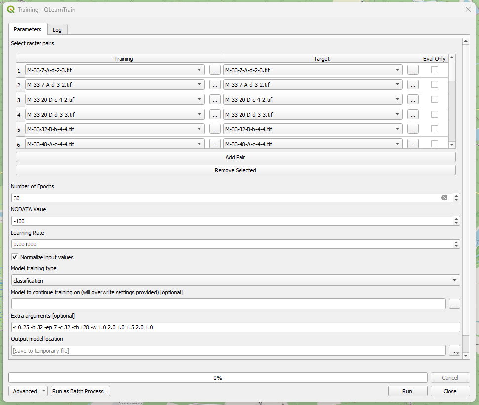
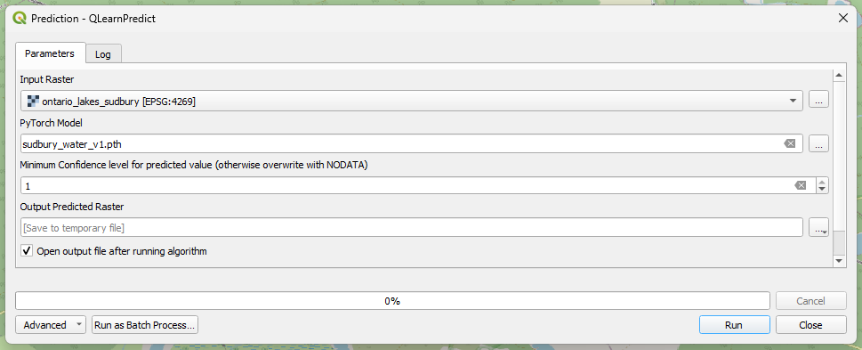

.. QLearn documentation master file

QLearn - Neural Network Training for QGIS
=========================================

.. image:: _static/logo.png
   :width: 128px
   :align: right

**QLearn** is a QGIS plugin that allows you to train a UNet segmentation neural network architecture to segment and classify raster data. It can also use pretrained models to make predictions on raster data.

Key Features
-----------

* Train neural networks directly from QGIS
* Use the UNet architecture for segmentation tasks
* Process and prepare raster data for training
* Make predictions using trained models
* Visualize results within QGIS

The plugin integrates with QGIS's Processing Framework, allowing you to easily incorporate machine learning into your geospatial workflows.

Requirements
------------

* QGIS 3.26+ (earlier versions are untested but may work)
* torch and torchvision Python packages
* OsGeo4w (Reccomended)
* Windows 10+ (Linux and MacOS are untested but may work)

.. toctree::
   :maxdepth: 2
   :caption: Contents:
   
   tutorial
   settings
   faq
   examples
   about

